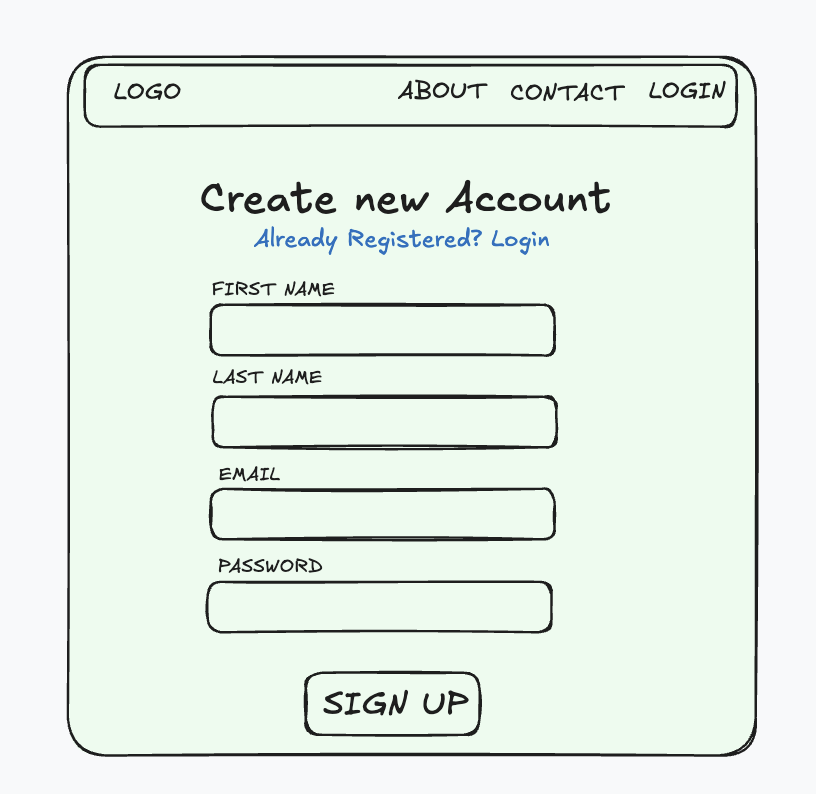
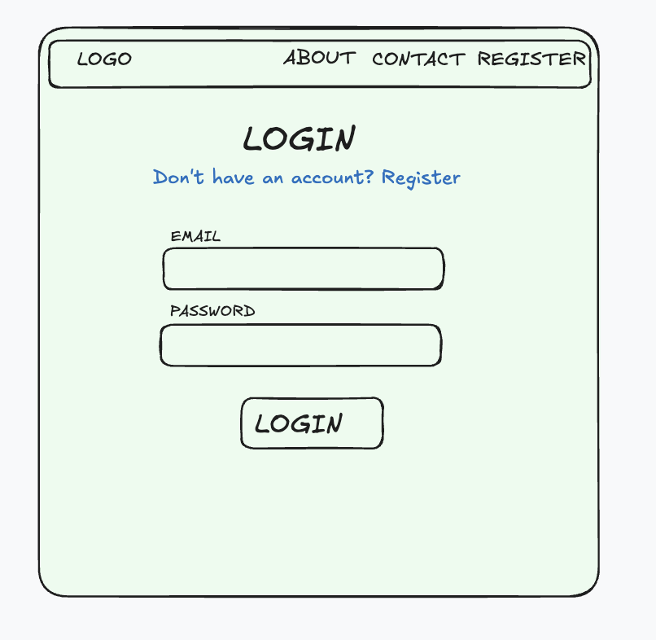
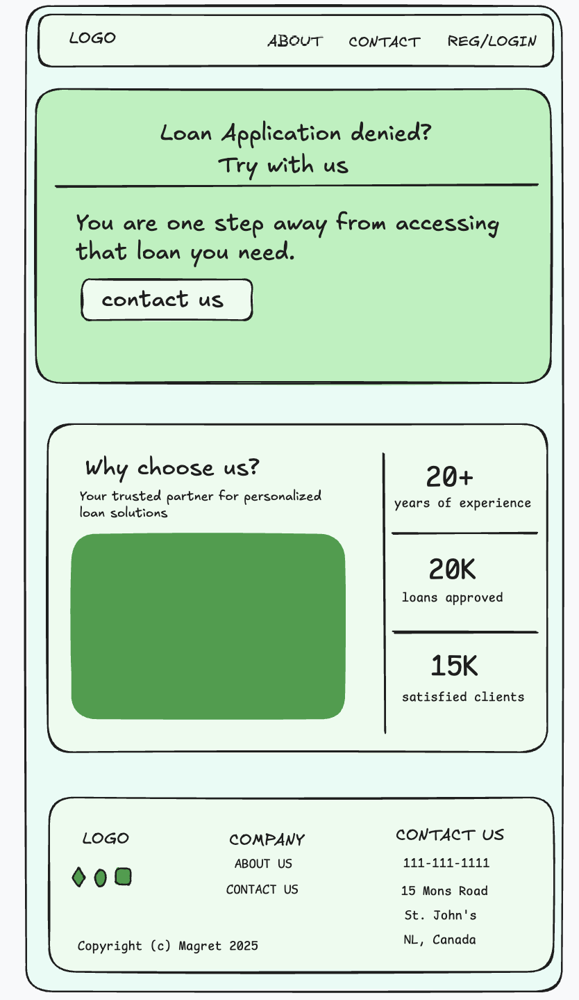
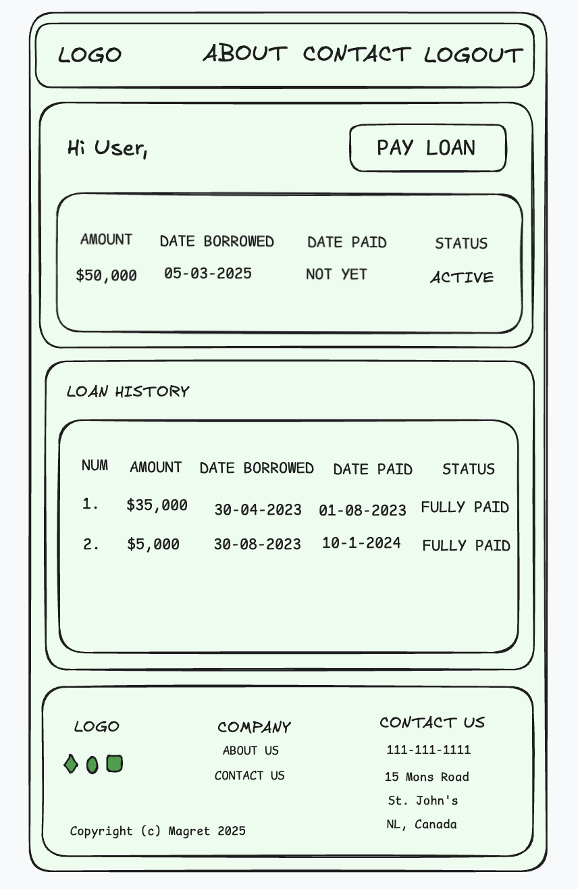
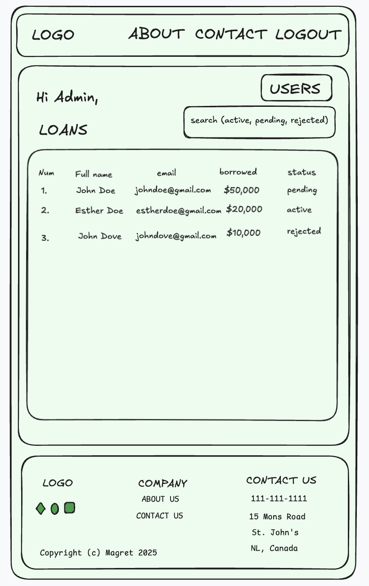
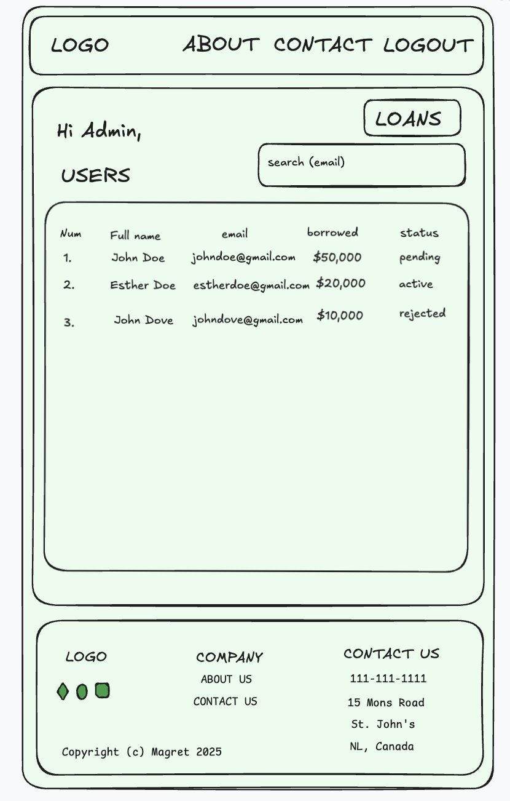
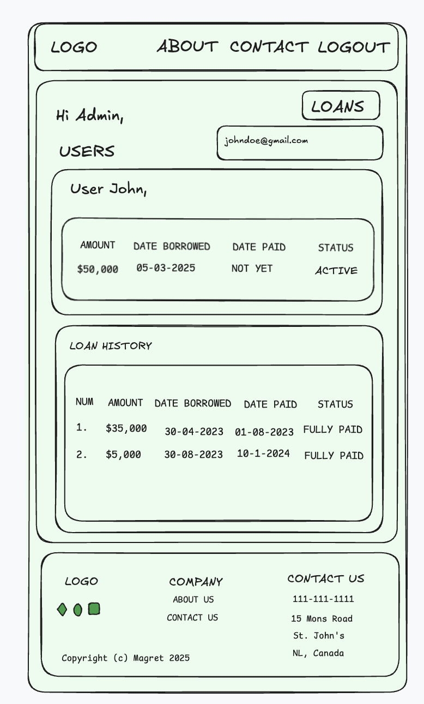
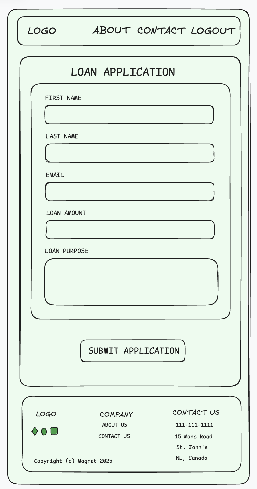
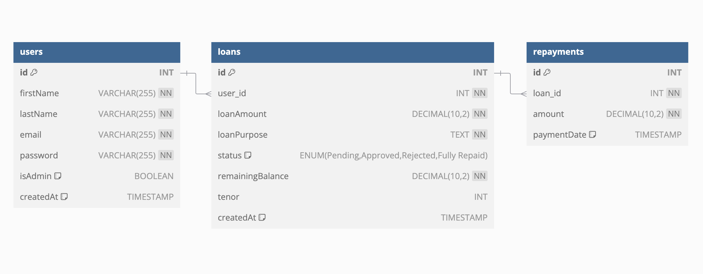

# Project Title
InstaLoanX

## Overview
InstaLoanX is a **streamlined loan management system** that enables users to apply for loans, track their application status, and make repayments. The platform also includes an **admin dashboard** where loan applications can be reviewed, approved, or rejected, and repayments can be monitored.

### Problem Space
Many individuals and small businesses struggle with accessing and managing loans efficiently. Traditional loan application processes are often cumbersome, requiring significant paperwork and manual approvals. InstaLoanX simplifies loan applications by providing a digital platform where users can easily apply for loans and track their status, while administrators can manage applications and repayments seamlessly.

### User Profile
1. **Loan Applicants (Users)**:
    - Individuals or businesses in need of financial assistance.
    - They will apply for loans, track application status, and make repayments in installments.
2. **Admin Users**:
    - Financial institutions or loan managers who review applications.
    - They will approve or reject loan requests and monitor repayments.
3. **Special Considerations**:
    - Secure authentication to protect sensitive financial information.
    - User-friendly interface for seamless application and repayment tracking.

### Features
1. **User Features:**
    - **User Registration and Login**: Users can create an account and log in.
    - **Loan Application**: Users can submit loan requests (Full Name, Email, Loan Amount, Loan Purpose).
    - **Loan Status Tracking**: Users can view the current status of their loan applications.
    - **Dashboard View**: A user dashboard to manage loan applications.
    - **Loan Repayment**: Users can repay their loans fully.
2. **Admin Features:**
    - **Application Review**: View all loan applications.
    - **Loan Status Management**: Accept or reject loan applications.
    - **Repayment Monitoring**: Admins can track loan repayments.
    - **User Management**: Admins can manage registered users.

## Implementation

### Tech Stack
1. **Frontend**: React, SASS
2. **Backend**: Node.js, Express.js
3. **Database**: MySQL with Knex.js
4. **Authentication**: JWT
5. **Deployment**: (Potential options: Vercel, Render, or Heroku for backend).

### APIs
- No external APIs will be used for now.

### Sitemap
1. **Home Page**: Brief introduction and login/signup options.
2. **User Dashboard**:
    - Apply for a loan.
    - View submitted applications and statuses.
    - Make repayment.
3. **Admin Dashboard**:
    - View all applications.
    - Approve/reject loan requests.
    - Monitor repayment status.
3. **Authentication Pages**:
    - Login and registration.
4. **Error/Not Found Page**: Handles invalid routes.


### Mockups









### Data


### Endpoints
**User Endpoints:**
1. **POST /api/auth/register**
    - Register a new user.

    _**Request Body**_:
    ```
    {
        "firstName": "John",
        "lastName": "Doe",
        "email": "johndoe@example.com",
        "password": "password123"
    }
    ```

    _**Response**_:
    ```
    {
        "message": "User registered successfully.",
        "status": 201
    }
    ```

2. **POST /api/auth/login**
    - Login a user.

    _**Request Body**_:
    ```
    {
        "email": "johndoe@example.com",
        "password": "password123"
    }
    ```

    **_Response_**:
    ```
    {
        "message": "User logged in successfully.",
        "status": 200
    }
    ```

3. **POST /api/loans/apply**
    - Submit a loan application.

     _**Request Body**_:
    ```
    {
        "loan_amount": "5000",
        "loan_purpose": "Reason for the loan (e.g., business expansion, personal expenses)"
    }
    ```

    **_Response_**:
    ```
    {
        "message": "Loan application submitted successfully.",
         "status": 200
    }
    ```

4. **GET /api/loans/status**
    - Fetch loan application status.

    **_Response_**:
    ```
    {
        "loan_id": "12345",
        "status": "Pending", "Approved", "Rejected", "Fully Paid"
    }
    ```

5. **POST /api/loans/repay**
    - Make a loan repayment.

     _**Request Body**_:
    ```
    {
        "loanId": "12345",
        "amount": 1000
    }
    ```

    **_Response_**:
    ```
    {
        "message": "Loan repayment processed successfully."
    }
    ```

**Admin Endpoints:**
1. **GET /api/admin/loans**
    - View all loan applications.

    **_Response_**:
    ```
    [
        {
            "loanId": "12345",
            "userId": "8906,
            "firstName": John,
            "lastName": Doe,
            "loan_amount": 5000.00,
            "loan_purpose": "Business Expansion",
            "status": "Pending"
        },
        {
            "loanId": "67890",
            "userId": "56789",
            "firstName": John,
            "lastName": Doe,
            "loan_amount": 1000.00,
            "loan_purpose": "Personal Expenses",
            "status": "Approved"
        }
    ]
    ```

2. **PATCH /api/admin/loans/:id**
    - Update loan status (Accept/Reject/Fully Paid).

    **_Response_**:
    ```
    {
        "message": "Loan status updated successfully."
    }
    ```

3. **GET /api/admin/users**
    - View all users.

    **_Response_**:
    ```
    [
        {
            "user_id": "12345",
            "user_name": "Jane Smith",
            "loan_amount": 1000.00,
            "loan_purpose": "Personal Expenses",
            "status": "Approved"
        },
        {
            "user_id": "67890",
            "user_name": "Jane Smith",
            "loan_amount": 1000.00,
            "loan_purpose": "Personal Expenses",
            "status": "Approved"
        }
    ]
    ```

4. **GET /api/admin/users/:id**
    - View a single user.

    **_Response_**:
    ```
    [
        {
            "user_id": "12345",
            "user_name": "Jane Smith",
            "loan_amount": 1000.00,
            "loan_purpose": "Personal Expenses",
            "status": "Approved"
        }
    ]
    ```


## Roadmaps (2 Weeks)

**Week 1: Core Functionality**
**Day 1: Project Setup**
    - Initialize the repository (e.g., instaloanx-app).
    - Set up the project structure:
    - Install dependencies and configure the database.
    - Implement home page

**Day 2: User Authentication**
    - Implement user registration and login.
    - Use JWT for secure authentication.
    - Create the users table in the database.
    - Use mock datas for users table

**Day 3: Loan Application**
    - Build the loan application form (Frontend).
    - Create the loans table in the database.
    - Implement backend logic to handle loan submissions.

**Day 4: User Dashboard**
    - Create a user dashboard to display:
    - Submitted loan applications.
    - Loan status (Pending, Approved, Rejected, Fully Repaid).
    - Fetch and display data from the backend.

**Day 5: Admin Dashboard**
    - Build an admin dashboard to:
    - View all loan applications.
    - Update loan status (Approve/Reject).

**Week 2: Repayments and Polish**
**Day 6: Admin backend actions/Repayment System**
    - Implement backend endpoints for admin actions.
    - Implement the "Make Payment" feature

**Day 7: Testing and Debugging**
    - Test all features thoroughly.
    - Fix any bugs or issues.

**Day 8: Styling and UI/UX**
    - Ensure the design is clean, responsive, and user-friendly with SASS.

**Day 9: Documentation and Final Touches**
    - Write a clear and concise README file.
    - Prepare for the final presentation.

**Day 10: Deployment**
    - Deploy the frontend (e.g., Vercel).
    - Deploy the backend (e.g., Render or Heroku).
    - Test the deployed application.

## Future Implementations
1. **Email Notifications**: Send email alerts for loan status updates and repayment reminders.
2. **Installment payments**: Provide means for users to pay in installment.
2. **Chatbot Integration**: Add a chatbot for FAQs and loan guidance.
3. **Advanced Analytics**: Provide insights into loan trends and repayment patterns.
4. **Mobile App**: Develop a mobile version of the platform for better accessibility.
5. **Multi-Language Support**: Add support for multiple languages to reach a wider audience.