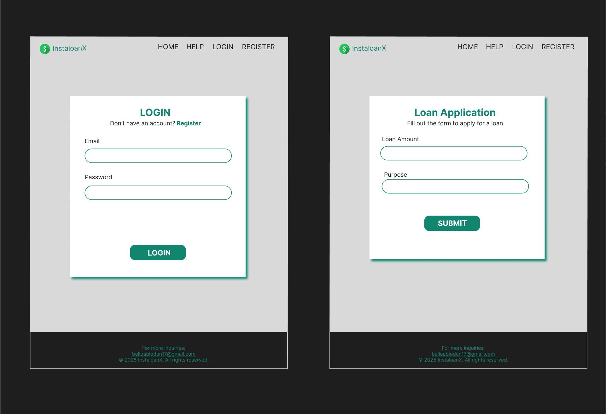

# Project Title

**InstaLoanX**

---

## Table of Contents

- [Overview](#overview)
- [Features](#features)
- [Technologies Used](#technologies-used)
- [Quick Start](#quick-start)
- [Sitemap](#sitemap)
- [Mockups](#mockups)
- [Database](#database)
- [Endpoints](#endpoints)
- [Quick Walkthrough](#quick-walkthrough)
- [Deployment](#deployment)
- [Future Implementations](#future-implementations)
- [How to Contribute](#how-to-contribute)
- [License](#license)
- [Contact](#contact)

---

## Overview

InstaLoanX is a **streamlined loan management system** that enables users to apply for loans, track their application status, and make installmental repayments. The platform also includes an **admin dashboard** where loan applications can be reviewed, approved, or rejected, and repayments can be monitored.

---

## Problem Space

Many individuals and small businesses struggle with accessing and managing loans efficiently. Traditional loan application processes are often cumbersome, requiring significant paperwork and manual approvals. InstaLoanX simplifies loan applications by providing a digital platform where users can easily apply for loans and track their status, while administrators can manage applications and repayments seamlessly.

## Features

1. **User Features:**
   - **User Registration and Login**: Users can create an account and log in.
   - **Loan Application**: Users can submit loan requests (Loan Amount and Loan Purpose).
   - **Loan Status Tracking**: Users can view the current status of their loan applications.
   - **Dashboard View**: A user dashboard to manage loan applications.
   - **Loan Repayment**: Users can repay their loans at installment.
2. **Admin Features:**
   - **Application Review**: View all loan applications.
   - **Loan Status Management**: Accept or reject loan applications.
   - **Repayment Monitoring**: Admins can track loan repayments.
   - **User Management**: Admins can manage registered users.

---

## Technologies Used

### Frontend

- **HTML, CSS, SASS**: For structuring and styling the application.
- **React**: For building a dynamic and responsive user interface.

### Backend

- **Express.js**: For building robust APIs.
- **Knex.js**: For database query building and migrations.
- **JWT (JSON Web Tokens)**: For secure user authentication.

### Database used

- **MySQL**: For storing and managing user, loan, and repayment data.

### APIs

- No external APIs was used.

---

## Quick Start

1. Clone the repository:
   ```bash
   git clone https://github.com/Magret1730/instaloanx-app.git
   ```
2. Install dependencies:
   `npm install`
3. Create `.env` file using `.env_example` file.
4. Start the development server:
   `npm run dev`
5. Open your browser and navigate to
   `http://localhost:5173`

---

## Sitemap

1. **Home Page**: Brief introduction, help on navbar that helps users on what to do on the site and login/signup options.
2. **User Dashboard**:
   - Apply for a loan.
   - View submitted applications and statuses.
   - Make repayment.
3. **Admin Dashboard**:
   - View all applications.
   - Approve/reject loan requests.
   - Monitor repayment status.
4. **Authentication Pages**:
   - Login and registration.
5. **Error/Not Found Page**: Handles invalid routes.

---

### Figma Designs

<!-- 


 -->
**[Link To InstaloanX Design On Figma](https://www.figma.com/design/u2gKS7ifPagYso0AEHiyUq/InstaloanX?node-id=0-1&t=9CRpjgKD7NpSBltD-1)**





---

## Database


---

## Endpoints

1. **GET /api/v1/loans/**
   - View all loan applications.
2. **PUT /api/v1/loans/:loanId/status**
   - Update loan status (Approve/Reject).
3. **GET /api/v1/users**
   - View all registered users.
4. **GET /api/v1/users/:id**
   - View details of a specific user.
5. **GET /api/v1/users/:id/loans**
   - View loan history of a specific user.
6. **GET /api/v1/loans/loanHistory**
   - View loan history of all users.

For detailed request and response examples, refer to the [Backend README](https://github.com/Magret1730/instaloanx-app/blob/develop/README.md).

---

## Quick Walkthrough

For a detailed demonstration of InstaLoanX, check out our **walkthrough video**:
[Inserting Link to Video Here]

---

## Deployment

InstaLoanX is deployed and accessible online. Here’s how the deployment is structured:

- **Frontend**: Hosted on [Vercel](https://vercel.com). // Fixing this siin
- **Backend**: Hosted on [Heroku](https://git.heroku.com/instaloanx.git).
- **Database**: Managed using [Supabase](https://supabase.com).

You can access the live application here: [Inserting Live Application Link]

---

## Roadmaps (2 Weeks)

**Week 1: Core Functionality**

- Project setup and initialization.
- User authentication (registration and login).
- Loan application feature.
- User and admin dashboards.

**Week 2: Repayments and Polish**

- Repayment functionality.
- Testing, debugging, and UI/UX enhancements.
- Deployment and final touches.

---

## Future Implementations

1. **Email Notifications**: Send email alerts for loan status updates and repayment reminders.
2. **Installment Payments Records**: Provide detailed histories of installment payments for users and admins.
3. **Chatbot Integration**: Add a chatbot for FAQs and loan guidance.
4. **Advanced Analytics**: Provide insights into loan trends and repayment patterns.
5. **Mobile App**: Develop a mobile version of the platform for better accessibility.
6. **Multi-Language Support**: Add support for multiple languages to reach a wider audience.

---

## How to Contribute

We welcome contributions from the community! If you'd like to contribute to InstaLoanX, please follow these steps:

1. Fork the repository.
2. Create a new branch for your feature or bug fix.
3. Submit a pull request with a detailed description of your changes.

---

## License

InstaLoanX is licensed under the [MIT License](./LICENSE). Feel free to use, modify, and distribute the code as per the license terms.

---

## Contact

For any questions or feedback, please reach out to:

- **Email**: [belloabiodun17@gmail.com](mailto:belloabiodun17@gmail.com)
- **GitHub**: [Magret1730](https://github.com/Magret1730)
- **LinkedIn**: [Oyedele Abiodun](https://www.linkedin.com/in/oyedele-abiodun/)
